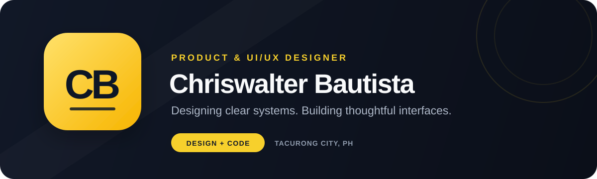
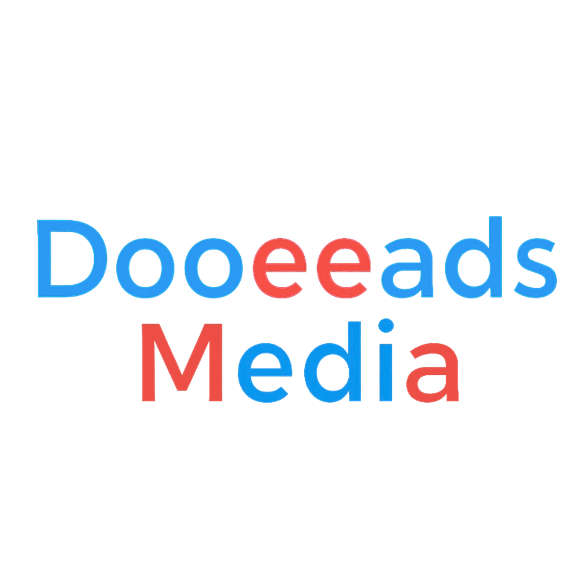
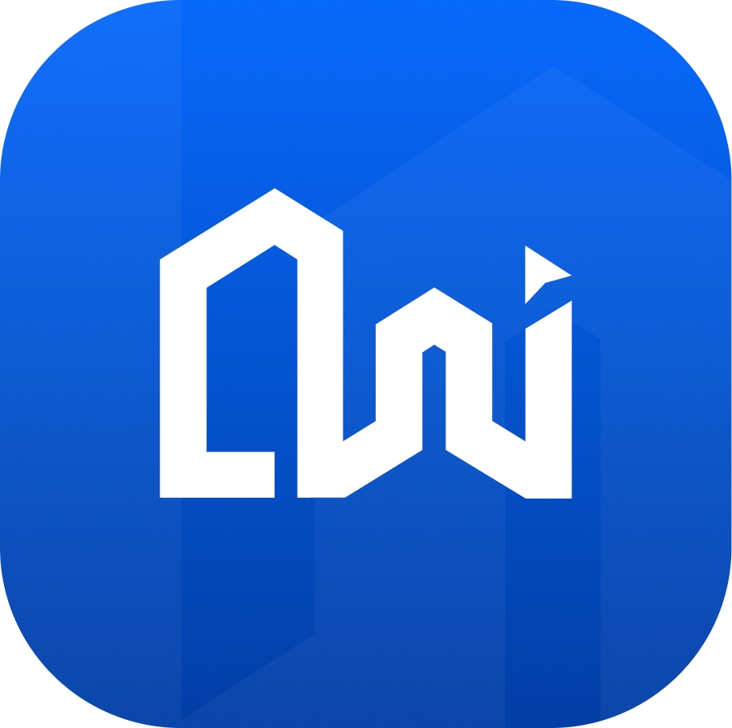
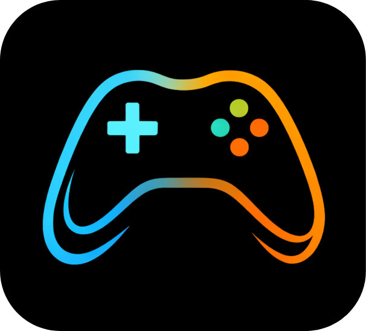
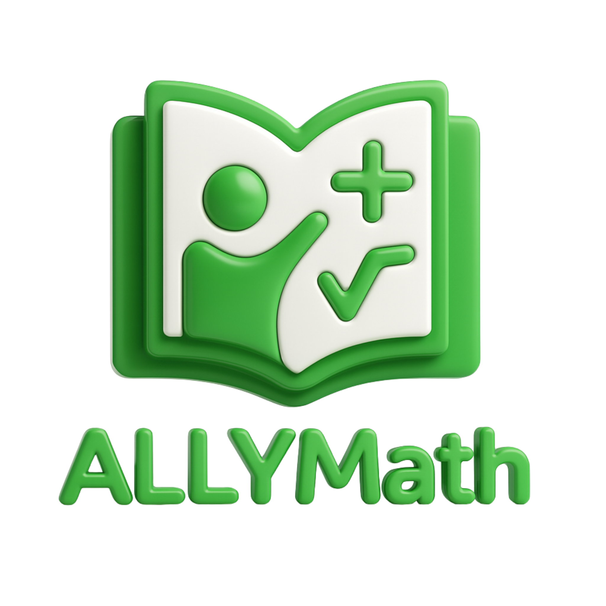
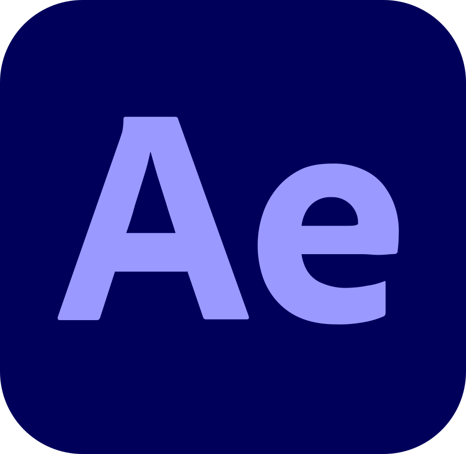
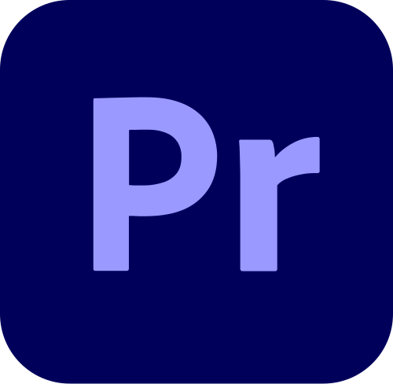
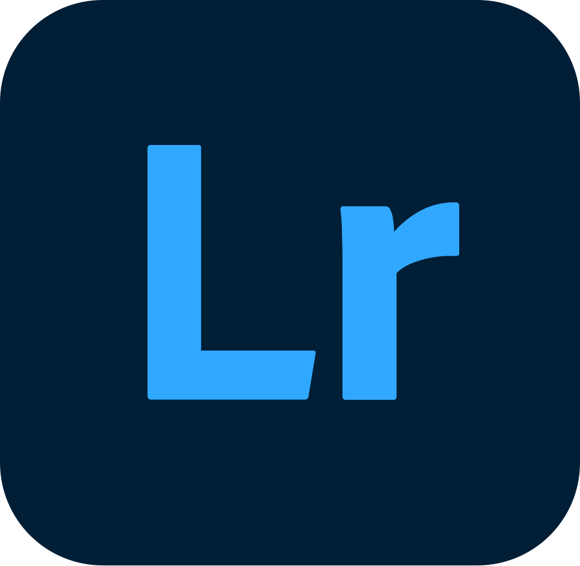

  

  
  
  

## Hello

I am a design-led product builder and Computer Science graduate from the **University of the Philippines Mindanao**, based in **Tacurong City, Philippines**. I specialize in turning complex content and workflows into clear, accessible, and visually coherent digital experiences.

My core strength is **product and UI/UX design**. I also build responsive frontend experiences, which lets me carry design intent from early concepts through implementation.

## What I Do

| Product & UX Design | Interface & Visual Design | Frontend Development |
|:---|:---|:---|
| User flows, information architecture, wireframes, prototypes, and usability-minded decisions. | Responsive UI, typography, visual hierarchy, component systems, and brand direction. | Design-faithful interfaces, responsive layouts, reusable components, and implementation review. |

## Featured Work

I designed and implemented the work below. My contribution spans product thinking, visual direction, UI/UX, and development. For **MonJeuMobile** and **GamesBeat**, I led the design and frontend implementation while the backend was developed separately.

<table>
  <tr>
    <td width="50%" valign="top">
      

        
      

      <h3>Trusted Weight Guide</h3>
      
A content-led experience shaped around clear information architecture, readable layouts, and confident navigation.

      
<strong>WEB DESIGN · UI/UX · FULL-STACK DEVELOPMENT</strong>

    </td>
    <td width="50%" valign="top">
      

        
      

      <h3>ControlRX</h3>
      
A service-oriented experience that turns complex information into a structured and approachable user journey.

      
<strong>PRODUCT DESIGN · UI/UX · FULL-STACK DEVELOPMENT</strong>

    </td>
  </tr>
  <tr>
    <td width="50%" valign="top">
      

        
      

      <h3>Dooeeads Media</h3>
      
A cohesive brand and business website shaped through visual identity, clear hierarchy, and concise digital storytelling.

      
<strong>BRANDING · UI/UX DESIGN · FRONTEND DEVELOPMENT</strong>

    </td>
    <td width="50%" valign="top">
      

        
      

      <h3>CrawenPay</h3>
      
A product interface exploration balancing clear user flows, a distinctive identity, and responsive presentation.

      
<strong>PRODUCT DESIGN · UI SYSTEMS · FULL-STACK DEVELOPMENT</strong>

    </td>
  </tr>
  <tr>
    <td width="50%" valign="top">
      

        
      

      <h3>MonJeuMobile</h3>
      
A responsive game website designed for engaging discovery and a consistent experience across desktop and mobile.

      
<strong>UI/UX DESIGN · FRONTEND DEVELOPMENT</strong>

    </td>
    <td width="50%" valign="top">
      

        
      

      <h3>Pasyente-Atiman</h3>
      
A mobile application shaped around accessible interactions, intuitive navigation, and straightforward user flows.

      
<strong>PRODUCT DESIGN · MOBILE UI/UX · MOBILE DEVELOPMENT</strong>

    </td>
  </tr>
  <tr>
    <td width="50%" valign="top">
      

        
      

      <h3>ALLYMath</h3>
      
A mobile learning application designed to make educational content approachable, engaging, and easy to navigate.

      
<strong>MOBILE UI/UX · INTERACTION DESIGN · MOBILE DEVELOPMENT</strong>

    </td>
    <td width="50%" valign="top">
      

        
      

      <h3>GamesBeat</h3>
      
A responsive game website focused on editorial hierarchy, content discovery, and clean desktop and mobile browsing.

      
<strong>UI/UX DESIGN · FRONTEND DEVELOPMENT</strong>

    </td>
  </tr>
</table>

## Toolkit

### Design & Creative Production

  
  
  
  

### Frontend & Web Platforms

  

  
  
  

### Mobile, Backend & Cloud

  
  

### Game Development

  

### Workflow & Automation

  
  
  
  
  
  

## Let’s Work Together

I am open to freelance, collaborative, and remote opportunities in **product design, UI/UX, web design, and frontend development**.

  <a href="mailto:chriswalterbautista@gmail.com"><strong>Email me</strong></a>
  &nbsp;·&nbsp;
  <a href="https://www.linkedin.com/in/chriswalter-bautista-53635921b"><strong>Connect on LinkedIn</strong></a>

